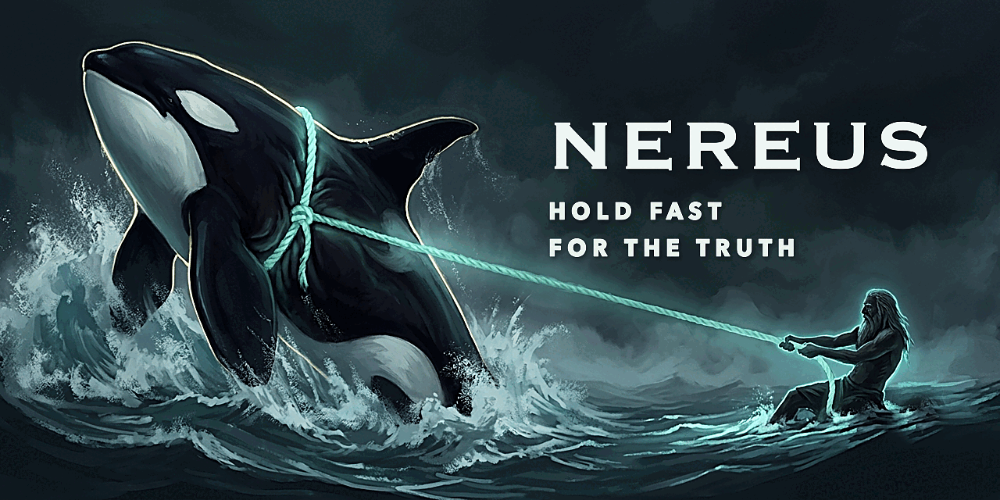
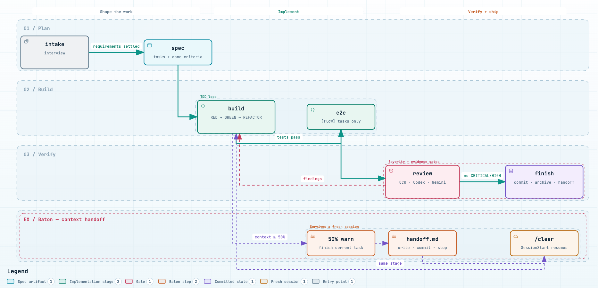

<p align="center">
  
</p>

<p align="center"><strong>Claude Code를 위한 개발 하네스.</strong></p>

<p align="center">
  <a href="https://github.com/snwlee/Nereus/actions/workflows/ci.yml"></a>
  
  <a href="LICENSE"></a>
  
</p>

<p align="center"><a href="README.md">English</a> · <b>한국어</b></p>

---

인터뷰로 시작한다. 코드보다 스펙이 먼저다. TDD는 훅이 강제한다. 리뷰어 셋이 병렬로 본다. 컨텍스트가 차기 전에 다음 세션에 넘긴다.

## 설치

```
/plugin marketplace add snwlee/Nereus
/plugin install nereus@nereus
/nereus:setup
```

Node 20 이상과 Git이 필요하다. `setup`이 외부 도구를 감지하고, 승인한 것만 설치하고, 설정 파일을 만든다.

### 플러그인

코어가 워크플로 자체다. 도메인 팩은 스킬과 전문가 에이전트 하나씩을 더하고, 필요한 것만 설치한다. 코어를 고치지 않고 데이터만 있는 `nereus-extension.json` 으로 붙는다.

| 플러그인 | 버전 | 더하는 것 |
|---|---|---|
| `nereus` | 0.17.1 | 워크플로 본체: 스킬 23종, 전문가 에이전트 10종, Node 훅, Baton 핸드오프, setup·doctor |
| `nereus-game` | 0.3.0 | 게임 개발: 로블록스·Unity(폰)·Switch·Flutter/Flame 어댑터와 레벨·밸런스·내러티브·사운드·라이브옵스·규정 준수 스킬 |
| `nereus-ads` | 0.1.0 | AdMob 운영: 계정을 살려두는 정책 게이트, 배치 설계, 수익 레버 |
| `nereus-l10n` | 0.1.0 | 현지화: 소스 문자열·스토어 등재·ASO, 그리고 로케일 하나를 통째로 깨뜨리는 진짜 제약인 폰트 커버리지 |
| `nereus-3d` | 0.1.0 | three.js: 불완전한 `dispose`, 배선되지 않은 dispose 헬퍼, `renderer.info` 계측 부재, 드로우콜 예산과 GPU 누수 |

```
/plugin install nereus-game@nereus     # nereus-ads, nereus-l10n, nereus-3d 도 같은 방식
/nereus:doctor                         # 무엇이든 설치한 뒤에는 가려진 MCP·라우트 충돌을 본다
```

각 팩은 자기 고유 어휘로만 좁게 라우팅한다. `/nereus:doctor` 는 충돌을 보고할 뿐 아무것도 지우지 않는다.

## 흐름

<p align="center">
  <picture>
    <source media="(prefers-color-scheme: dark)" srcset="docs/assets/nereus-flow-dark.png">
    
  </picture>
</p>

각 단계는 **자기 게이트를 통과했을 때만** 다음 단계를 부른다. 평소에는 `/nereus:intake` 만 치면 된다.

Baton 은 Claude Code 자체 자동 압축(손실 요약)보다 먼저 작동한다. 컨텍스트 50% 에서 현재 태스크만 마무리하라고 알리고, 70% 에서 멈추고 handoff 를 요구한다. `/nereus:setup` 이 `CLAUDE_AUTOCOMPACT_PCT_OVERRIDE=80` 설정을 제안해 50% 경고 → 70% 하드 스톱 → 80% 압축(최후 수단) 순서를 만든다.

<sub><a href="https://github.com/tt-a1i/archify">archify</a>(MIT)로 저장소에 들어 있는 JSON IR 에서 생성했다 — 손으로 그리지 않았다: <a href="docs/diagrams/nereus-flow.workflow.json"><code>docs/diagrams/nereus-flow.workflow.json</code></a>. 재생성은 <code>archify deliver workflow docs/diagrams/nereus-flow.workflow.json out.html --quality showcase</code>.</sub>

## 커맨드

| 커맨드 | 역할 |
|---|---|
| `/nereus:setup` | 도구 감지·설치, 설정 파일 생성, MCP 상주 비용 진단 |
| `/nereus:intake [--quick]` | 요구사항이 명확해질 때까지 인터뷰 |
| `/nereus:spec` | 스펙과 태스크 생성 (신규/기존 자동 판별) |
| `/nereus:build` | TDD로 태스크 구현 |
| `/nereus:e2e` | `[flow]` 태스크의 엔드투엔드 검증 |
| `/nereus:debug` | 버그·실패의 근본 원인 조사 4단계 (수정 전 필수) |
| `/nereus:design` | 디자인·UI·UX 작업 3단계 — 방향 후보 생성(ui-ux-pro-max) → 방향 비평 → 렌더 비평. finish 하드 게이트 |
| `/nereus:review` | 병렬 리뷰, 심각도 게이트 |
| `/nereus:finish` | 완료 게이트(테스트 evidence + 무결성 검사 + 디자인 피드백) → 커밋, 아카이브, handoff 갱신 |
| `/nereus:handoff` | 다음 세션용 상태 저장. `/clear` 하면 SessionStart 훅이 다시 주입해 자동으로 이어집니다 — `/nereus:resume` 은 수동 재개(다른 tasks 파일 지정 등)용입니다. |
| `/nereus:loop "목표" --max N` | 반복마다 새 세션으로 도는 자율 루프 |
| `/nereus:continue on\|off` | 같은 세션에서 남은 태스크 자동 계속 (기본 꺼짐, 컨텍스트 경고선에서 자동 해제) |
| `/nereus:learn` | 훅이 모은 학습 후보를 검토·승인. 승인된 규칙만 다음 세션에 주입 |
| `/nereus:hud` | 한 줄 상태: 태스크 진행률, 검증 상태, 컨텍스트 % |
| `/nereus:doctor` | 다른 하네스 플러그인과의 충돌 보고 — 가려진 MCP 서버, 중복된 에이전트·스킬 이름, 공유 훅 지점. 보고만 하고 절대 지우지 않는다 |
| `/nereus:pdf`, `/nereus:image`, `/nereus:research`, `/nereus:seo` | 단독 스킬 |

## 스킬 자동 호출

압축된 description 만으로는 모델이 스킬을 떠올리지 못한다. 두 지점에서 심는다.
- **SessionStart**: 스킬 맵(트리거 → 스킬)을 새 컨텍스트마다 한 번 주입.
- **UserPromptSubmit**: 요청을 정규식으로 보고 해당 스킬을 한 줄로 지목(`hooks/scripts/lib/router.mjs`). 같은 스킬은 세션당 한 번만. LLM 호출 없음.

프로세스 스킬(`debug`·`intake`)이 구현 스킬보다 먼저다.

## 에이전트

코어: `architect` `backend` `frontend` `app` `researcher` `seo` `reviewer` `security` `qa` `writer`

도메인 팩이 전문가를 하나씩 더한다: `gameplay-engineer` `level-designer` `economy-designer` `narrative-writer` `art-director` `game-ux`(게임) · `ads-engineer` · `l10n-engineer` · `graphics-engineer`(3D).

에이전트는 페르소나, 허용 도구 목록, 출력 계약으로 이루어진다. 에이전트끼리 직접 부르지 않고 워크플로 스킬이 조율한다. 도메인 에이전트는 TDD 절차를 다시 정의하지 않고 `nereus:build` 것을 그대로 쓴다.

## 훅

| 이벤트 | 동작 |
|---|---|
| UserPromptSubmit | `learn-watch`: 교정을 관찰에 남기고 세션당 한 번만 안내 |
| PreToolUse | `pre-tool-guard`: 규칙(regex)에 걸리는 명령·편집 차단(`--no-verify`, force push, 시크릿 파일). `git commit` 시 스테이징의 시크릿·`.env` 는 차단, 디버그 로그는 경고만 |
| SessionStart | `handoff.md`와 신뢰도 높은 학습 규칙 주입, 미설치 도구 알림 |
| PostToolUse | `tdd-guard`: 테스트보다 소스를 먼저 고치면 경고. `baton-meter`: 50% 경고, 70% 하드 스톱. `observe`: 판정 없이 관찰만 적재 |
| PreCompact | 자동 압축 전에 handoff 작성 요구 |
| Stop | `/nereus:continue` 가 켜져 있으면 다음 태스크로 이어감. 아니면 미커밋 변경·오래된 handoff·evidence 상태 알림 |

훅은 전부 Node 스크립트다. bash 없음, 런타임 의존성 0, macOS와 Windows에서 동일.

## 설정

`~/.config/nereus/config.json` (Windows: `%APPDATA%\nereus\config.json`). 프로젝트의 `.nereus/config.json`이 우선한다.

```json
{
  "secondOpinion": "both",
  "baton": { "warn": 0.5, "hard": 0.7 },
  "tdd": { "exclude": ["**/migrations/**", "**/*.config.*", "**/generated/**"] },
  "design": { "enforce": "block", "widths": [320, 768, 1440] },
  "commitQuality": { "block": ["secret", "env_file"], "warn": ["debug_log"] },
  "pdf": { "engine": "typst", "font": "Noto Sans KR" },
  "image": { "backend": "auto" }
}
```

`secondOpinion` 은 리뷰어를 고른다. `"both"`(기본), `"codex"`, `"gemini"`, `"none"`(결정론적 OCR 리뷰만), 또는 `["ocr", "gemini"]` 같은 배열.

`design.enforce` 는 기본이 `"block"` 이다. 디자인 표면을 만지고 Gemini 비평 라운드를 돌리지 않으면 `finish` 가 막힌다. 게이트 없이 경고만 받으려면 `"warn"` 으로 낮춘다.


## 개발

```bash
npm ci && npm test
claude plugin validate .
```

설계 문서: [`docs/specs/2026-09-05-nereus-harness-design.md`](docs/specs/2026-09-05-nereus-harness-design.md)

## 라이선스

[MIT](LICENSE)
