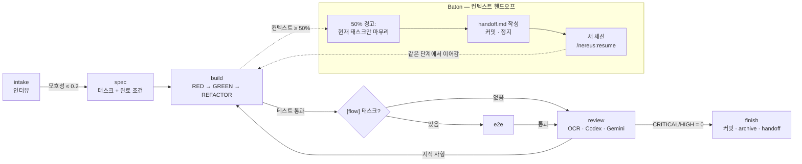

<p align="center">
  
</p>

<h1 align="center">Nereus</h1>

<p align="center"><strong>Claude Code를 위한 개발 하네스.</strong></p>

<p align="center">
  <a href="https://github.com/snwlee/Nereus/actions/workflows/ci.yml"></a>
  
  <a href="LICENSE"></a>
  
</p>

<p align="center"><a href="README.md">English</a> · <b>한국어</b></p>

---

인터뷰로 시작한다. 코드보다 스펙이 먼저다. TDD는 훅이 강제한다. 리뷰어 셋이 병렬로 본다. 컨텍스트가 차기 전에 다음 세션에 넘긴다.

## 설치

```
/plugin marketplace add snwlee/Nereus
/plugin install nereus@nereus
/nereus:setup
```

Node 20 이상과 Git이 필요하다. `setup`이 외부 도구를 감지하고, 승인한 것만 설치하고, 설정 파일을 만든다.

## 흐름



각 단계는 게이트를 통과하면 다음 단계를 스스로 부른다. 평소에는 `/nereus:intake`만 치면 된다.

## 커맨드

| 커맨드 | 역할 |
|---|---|
| `/nereus:setup` | 도구 감지·설치, 설정 파일 생성 |
| `/nereus:intake [--quick]` | 요구사항이 명확해질 때까지 인터뷰 |
| `/nereus:spec` | 스펙과 태스크 생성 (신규/기존 자동 판별) |
| `/nereus:build` | TDD로 태스크 구현 |
| `/nereus:e2e` | `[flow]` 태스크의 엔드투엔드 검증 |
| `/nereus:review` | 병렬 리뷰, 심각도 게이트 |
| `/nereus:finish` | 완료 게이트(테스트 evidence + 무결성 검사) → 커밋, 아카이브, handoff 갱신 |
| `/nereus:handoff` / `/nereus:resume` | 다음 세션용 상태 저장 / 이어받기 |
| `/nereus:loop "목표" --max N` | 반복마다 새 세션으로 도는 자율 루프 |
| `/nereus:pdf`, `/nereus:image`, `/nereus:research`, `/nereus:seo` | 단독 스킬 |

## 에이전트

`architect` `backend` `frontend` `app` `researcher` `seo` `reviewer` `security` `qa` `writer`

에이전트는 페르소나, 허용 도구 목록, 출력 계약으로 이루어진다. 에이전트끼리 직접 부르지 않고 워크플로 스킬이 조율한다.

## 훅

| 이벤트 | 동작 |
|---|---|
| PreToolUse | `pre-tool-guard`: 규칙(regex)에 걸리는 명령·편집 차단(`--no-verify`, force push, 시크릿 파일). `git commit` 시 스테이징의 시크릿·`.env`·`console.log` 검사 |
| SessionStart | `handoff.md` 주입, 미설치 도구 알림 |
| PostToolUse | `tdd-guard`: 테스트보다 소스를 먼저 고치면 경고. `baton-meter`: 50% 경고, 70% 하드 스톱 |
| PreCompact | 자동 압축 전에 handoff 작성 요구 |
| Stop | 미커밋 변경, 오래된 handoff, 테스트 evidence(FRESH/STALE/MISSING) 알림 |

훅은 전부 Node 스크립트다. bash 없음, 런타임 의존성 0, macOS와 Windows에서 동일.

## 설정

`~/.config/nereus/config.json` (Windows: `%APPDATA%\nereus\config.json`). 프로젝트의 `.nereus/config.json`이 우선한다.

```json
{
  "secondOpinion": "both",
  "baton": { "warn": 0.5, "hard": 0.7 },
  "tdd": { "exclude": ["**/migrations/**", "**/*.config.*", "**/generated/**"] },
  "pdf": { "engine": "typst", "font": "Noto Sans KR" },
  "image": { "backend": "auto" }
}
```

Baton은 Claude Code 자체 자동 압축(손실 요약)보다 먼저 작동한다. `/nereus:setup`이 `CLAUDE_AUTOCOMPACT_PCT_OVERRIDE=80` 설정을 제안해 50% 경고 → 70% 하드 스톱 → 80% 압축(최후 수단) 순서를 만든다.

## 개발

```bash
npm ci && npm test
claude plugin validate .
```

설계 문서: [`docs/specs/2026-09-05-nereus-harness-design.md`](docs/specs/2026-09-05-nereus-harness-design.md)

## 라이선스

[MIT](LICENSE)
